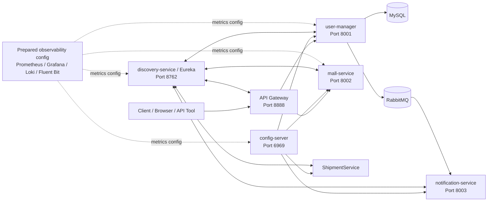
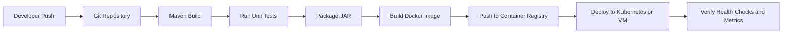

# VMall Microservices Platform

VMall is a portfolio microservices project built with Spring Boot and Spring Cloud. The project demonstrates a basic e-commerce backend architecture using centralized configuration, service discovery, API Gateway routing, OAuth2/JWT security, asynchronous messaging with RabbitMQ, and prepared observability configuration.

This repository is designed to demonstrate practical DevOps and backend engineering fundamentals for a Fresher DevOps position: service decomposition, environment-based configuration, service registry, gateway routing, message broker integration, health checks, metrics exposure, and deployment readiness planning.

Important note: this repository does not currently include Dockerfiles, a full Docker Compose setup for all application services, Kubernetes manifests, or an implemented CI/CD pipeline. These items are documented as planned improvements and suggested future work.

## Table of contents

- Project overview
- Current implementation status
- Architecture
- Service list
- Technology stack
- Repository structure
- Prerequisites
- Configuration
- How to run locally
- API endpoints
- Observability
- DevOps highlights
- Known notes before running
- Improvement roadmap
- Suggested CI/CD pipeline design
- What I learned from this project

## Project overview

The system is divided into multiple independent services:

- config-server: centralizes configuration for other services using Spring Cloud Config Server.
- discovery-service: provides service registration and discovery using Netflix Eureka.
- api-gateway: provides a single entry point for clients and routes requests to backend services.
- user-manager: manages user accounts, acts as an OAuth2 Authorization Server, stores users in MySQL, and publishes notification messages to RabbitMQ.
- mall-service: provides product-related APIs and validates JWT tokens issued by user-manager.
- notification-service: receives notification requests directly through REST or asynchronously through RabbitMQ.
- shipment-service: reserved for shipment-related features.
- common-lib/common-api: shared response model used across services.
- observability: contains prepared configuration files for Prometheus, Grafana, Loki, and Fluent Bit.

## Current implementation status

| Area | Status |
|---|---|
| Microservices with Spring Boot | Implemented |
| Centralized configuration with Spring Cloud Config Server | Implemented |
| Service discovery with Eureka | Implemented |
| API Gateway routing | Implemented |
| OAuth2 Authorization Server | Implemented |
| JWT Resource Server | Implemented |
| RabbitMQ producer and consumer flow | Implemented |
| MySQL integration | Implemented |
| Shared Maven library | Implemented |
| Actuator health and metrics endpoints | Implemented |
| Prometheus/Grafana/Loki/Fluent Bit configuration | Prepared, not fully deployed |
| Dockerfiles for application services | Not implemented yet |
| Docker Compose for the full application stack | Not implemented yet |
| Kubernetes manifests | Not implemented yet |
| CI/CD pipeline | Not implemented yet |

## Architecture



## Service list

| Service | Port | Main responsibility | Key technologies |
|---|---:|---|---|
| config-server | 6969 | Centralized configuration | Spring Cloud Config Server, Actuator, Prometheus metrics endpoint |
| discovery-service | 8762 | Service registry | Netflix Eureka Server, Actuator, Prometheus metrics endpoint |
| api-gateway | 8888 | Gateway and routing | Spring Cloud Gateway, Eureka Client |
| user-manager | 8001 | User account management, OAuth2 authorization server, RabbitMQ producer | Spring Web, Spring Security, OAuth2 Authorization Server, JPA, MySQL, OpenFeign, RabbitMQ |
| mall-service | 8002 | Product API and protected resource server | Spring Web, Spring Security Resource Server, Swagger/OpenAPI, Eureka Client |
| notification-service | 8003 | Notification API and RabbitMQ consumer | Spring Web, RabbitMQ, Eureka Client |
| shipment-service | 8004 | Shipment service skeleton | Spring Web, Eureka Client |
| common-api | - | Shared API response model | Java library, Lombok |
| observability | - | Prepared monitoring and logging configuration | Prometheus config, Grafana provisioning, Loki datasource, Fluent Bit config |

## Technology stack

Application technologies:

- Java 17
- Maven
- Spring Boot
- Spring Cloud Config
- Spring Cloud Gateway
- Netflix Eureka
- Spring Security
- OAuth2 Authorization Server
- OAuth2 Resource Server with JWT
- Spring Data JPA
- MySQL
- RabbitMQ
- OpenFeign
- Spring Boot Actuator
- Micrometer Prometheus Registry

Prepared observability configuration:

- Prometheus
- Grafana
- Loki
- Fluent Bit

Planned DevOps technologies:

- Dockerfile for each application service
- Docker Compose for local full-stack startup
- GitHub Actions or GitLab CI for CI/CD
- Kubernetes manifests or Helm chart for deployment

## Repository structure

```text
.
├── api-gateway
│   └── src/main/resources/application.yml
├── common-lib
│   └── common-lib
│       ├── pom.xml
│       └── common-api
├── config-server
│   ├── configs
│   │   ├── api-gateway.yml
│   │   ├── application-local.yml
│   │   ├── application-swagger.yml
│   │   ├── discovery-service.yml
│   │   ├── mall-service.yml
│   │   ├── user-manager-local.yml
│   │   └── user-manager.yml
│   └── src/main/resources/application.yml
├── discovery-service
├── mall-service
├── notification-service
├── observability
│   ├── fluent-bit
│   ├── grafana
│   └── prometheus
├── shipment-service
├── user-manager
├── .gitignore
└── README.md
```

## Prerequisites

Install the following tools before running the project:

| Tool | Recommended version | Purpose |
|---|---|---|
| JDK | 17+ | Run Spring Boot services |
| Maven | 3.8+ | Build and run services |
| MySQL | 8.x | Database for user-manager |
| RabbitMQ | 3.x | Message broker for notification flow |
| Git | Latest stable | Source code management |

Docker is optional. This project does not currently provide Dockerfiles for the application services. Docker can still be used manually to start supporting services such as MySQL and RabbitMQ during local development.

Check your local environment:

```bash
java -version
mvn -version
git --version
```

If you want to use Docker for MySQL and RabbitMQ only:

```bash
docker --version
```

## Configuration

### 1. Config Server path

The Config Server currently uses native file-based configuration.

Current file:

```text
config-server/src/main/resources/application.yml
```

Current setting:

```yaml
spring:
  cloud:
    config:
      server:
        native:
          search-locations: file:///D:/microservice/config-server/configs
```

Before running on another machine, update `search-locations` to your local absolute path.

Example on Windows:

```yaml
search-locations: file:///D:/microservice/config-server/configs
```

Example on Linux/macOS:

```yaml
search-locations: file:///home/user/microservice/config-server/configs
```

### 2. MySQL configuration

The `user-manager` service uses MySQL through properties provided by Config Server.

Config file:

```text
config-server/configs/user-manager.yml
```

Required variables:

```yaml
spring:
  datasource:
    url: ${DB_URL}
    username: ${DB_USER}
    password: ${DB_PASSWORD}
```

Example local environment variables:

```bash
export DB_URL="jdbc:mysql://localhost:3306/user-manager?createDatabaseIfNotExist=true"
export DB_USER="root"
export DB_PASSWORD="root"
```

For Windows PowerShell:

```powershell
$env:DB_URL="jdbc:mysql://localhost:3306/user-manager?createDatabaseIfNotExist=true"
$env:DB_USER="root"
$env:DB_PASSWORD="root"
```

### 3. OAuth2 issuer configuration

`user-manager` acts as the OAuth2 Authorization Server. The service expects an issuer value.

Recommended local value:

```bash
export OAUTH2_ISSUER_URI="http://localhost:8001"
```

For Windows PowerShell:

```powershell
$env:OAUTH2_ISSUER_URI="http://localhost:8001"
```

### 4. RabbitMQ configuration

Both `user-manager` and `notification-service` use RabbitMQ with the following default values:

```yaml
spring:
  rabbitmq:
    host: localhost
    port: 5672
    username: guest
    password: guest
    virtual-host: "/"
```

Queue configuration:

```yaml
queue:
  notification:
    queue: notification-queue
    exchange: notification-exchange
    routing-key: notification-routing-key
```

## How to run locally

This repository is organized as multiple Maven projects. There is no root parent `pom.xml` for building every service in one command, so build and run each service individually.

Application services are currently run with Maven. Full containerized startup with Docker Compose has not been implemented yet.

### 1. Start MySQL

Option A: run MySQL locally using your installed MySQL service.

Create database:

```sql
CREATE DATABASE IF NOT EXISTS `user-manager`;
```

Option B: run MySQL manually with Docker:

```bash
docker run -d \
  --name vmall-mysql \
  -e MYSQL_ROOT_PASSWORD=root \
  -e MYSQL_DATABASE=user-manager \
  -p 3306:3306 \
  mysql:8.0
```

### 2. Start RabbitMQ

Option A: run RabbitMQ locally using your installed RabbitMQ service.

Option B: run RabbitMQ manually with Docker:

```bash
docker run -d \
  --name vmall-rabbitmq \
  -p 5672:5672 \
  -p 15672:15672 \
  rabbitmq:3-management
```

RabbitMQ Management UI:

```text
http://localhost:15672
Username: guest
Password: guest
```

### 3. Install common library

`user-manager` depends on `common-api`, so install the shared library first.

```bash
cd common-lib/common-lib
mvn clean install
```

### 4. Start config-server

```bash
cd config-server
mvn spring-boot:run
```

Health check:

```bash
curl http://localhost:6969/actuator/health
```

### 5. Start discovery-service

```bash
cd discovery-service
mvn spring-boot:run
```

Eureka Dashboard:

```text
http://localhost:8762
```

### 6. Start api-gateway

```bash
cd api-gateway
mvn spring-boot:run
```

Gateway base URL:

```text
http://localhost:8888
```

### 7. Start user-manager

```bash
cd user-manager
mvn spring-boot:run
```

### 8. Start mall-service

```bash
cd mall-service
mvn spring-boot:run
```

Swagger UI:

```text
http://localhost:8002/swagger-ui/index.html
```

### 9. Start notification-service

```bash
cd notification-service
mvn spring-boot:run
```

### 10. Start shipment-service

```bash
cd shipment-service
mvn spring-boot:run
```

## Recommended startup order

```text
1. MySQL
2. RabbitMQ
3. common-lib install
4. config-server
5. discovery-service
6. api-gateway
7. user-manager
8. mall-service
9. notification-service
10. shipment-service
```

## API endpoints

### User Manager

Create a new user account:

```bash
curl -X POST http://localhost:8001/api/v1/user/accounts \
  -H "Content-Type: application/json" \
  -d '{
    "username": "demo_user",
    "password": "123456",
    "email": "demo@example.com"
  }'
```

Expected result:

```json
{
  "status": "SUCCESS",
  "data": {
    "username": "demo_user",
    "email": "demo@example.com"
  },
  "message": null,
  "errorCode": null
}
```

When an account is created, `user-manager` publishes a welcome notification message to RabbitMQ.

### Notification Service

Send notification directly:

```bash
curl -X POST http://localhost:8003/api/v1/notifications \
  -H "Content-Type: application/json" \
  -d '{
    "sendTo": "demo@example.com",
    "title": "Welcome email",
    "message": "Welcome"
  }'
```

### Mall Service

Create product:

```bash
curl -X POST http://localhost:8002/api/v1/products \
  -H "Content-Type: application/json" \
  -H "Authorization: Bearer <access_token>" \
  -d '{
    "productName": "Laptop",
    "category": "Electronics"
  }'
```

Note: `mall-service` is protected by OAuth2 Resource Server, so a valid JWT access token is required.

## OAuth2 notes

The `user-manager` service includes an OAuth2 Authorization Server configuration with an in-memory client.

Client configuration:

```text
client_id: oidc-client
client_secret: secret
grant_type: authorization_code
scope: openid, profile
```

Configured redirect URIs:

```text
http://127.0.0.1:8080/login/oauth2/code/oidc-client
http://localhost:8002/swagger-ui/oauth2-redirect.html
```

Authorization endpoint example:

```text
http://localhost:8001/oauth2/authorize?response_type=code&client_id=oidc-client&redirect_uri=http://localhost:8002/swagger-ui/oauth2-redirect.html&scope=profile
```

Token endpoint:

```text
http://localhost:8001/oauth2/token
```

## Observability

Each main service exposes Spring Boot Actuator endpoints.

Common endpoints:

```text
/actuator/health
/actuator/info
/actuator/metrics
/actuator/prometheus
```

Example:

```bash
curl http://localhost:8001/actuator/health
curl http://localhost:8001/actuator/prometheus
```

The `observability` folder contains prepared configuration files:

```text
observability/
├── fluent-bit/fluent-bit.conf
├── grafana/dashboards/dashboards.yml
├── grafana/datasources/datasources.yml
└── prometheus/prometheus.yml
```

Prometheus scrape targets are prepared for:

- config-server:6969
- discovery-service:8762
- user-manager:8001
- mall-service:8002

Grafana datasource provisioning is prepared for:

- Prometheus
- Loki

Fluent Bit configuration is prepared to forward logs to Loki.

Current status: observability configuration exists, but a full observability stack deployment is not included yet. A future improvement is to add Docker Compose or Kubernetes manifests to run Prometheus, Grafana, Loki, and Fluent Bit together.

## DevOps highlights

This project demonstrates the following DevOps-related concepts:

| Area | Implementation in this project |
|---|---|
| Microservices architecture | Multiple independent Spring Boot services |
| Centralized configuration | Spring Cloud Config Server with native config repository |
| Service discovery | Eureka Server and Eureka Clients |
| API routing | Spring Cloud Gateway routes requests to backend services |
| Secure service communication | OAuth2 Authorization Server and JWT Resource Server |
| Asynchronous communication | RabbitMQ producer and consumer for notification flow |
| Database integration | MySQL with Spring Data JPA in user-manager |
| Shared library management | common-api installed as a Maven dependency |
| Health checks | Spring Boot Actuator health endpoint |
| Metrics | Micrometer Prometheus Registry and `/actuator/prometheus` |
| Monitoring preparation | Prometheus scrape configuration is prepared |
| Dashboard preparation | Grafana datasource and dashboard provisioning files are prepared |
| Log pipeline preparation | Fluent Bit to Loki configuration is prepared |
| Git hygiene | `.gitignore` excludes IDE files, build artifacts, logs, env files, and temporary files |

## Known notes before running

Please review these points before running the project locally:

1. The Config Server uses an absolute Windows path by default. Update `search-locations` in `config-server/src/main/resources/application.yml` for your machine.
2. `discovery-service` runs on port `8762`. Make sure all Eureka clients point to `http://localhost:8762/eureka`.
3. `api-gateway/src/main/resources/application.yml` currently points Eureka to `http://localhost:8761/eureka`; update it to `http://localhost:8762/eureka` if needed.
4. Some services use different Spring Boot and Spring Cloud versions. For a production-grade setup, align versions across services.
5. Dockerfiles, Docker Compose for the full application stack, Kubernetes manifests, and CI/CD pipeline files are not included yet. They are listed in the improvement roadmap below.

## Improvement roadmap

Planned DevOps improvements:

- Add Dockerfile for each service.
- Add `docker-compose.yml` for local full-stack development.
- Add centralized `.env.example` file.
- Add GitHub Actions or GitLab CI pipeline for build and test.
- Add container image build and push stage.
- Add Kubernetes Deployment, Service, ConfigMap, and Secret manifests.
- Add Helm chart for easier deployment.
- Add readiness and liveness probe configuration.
- Add centralized logging stack using Loki and Grafana.
- Add distributed tracing using OpenTelemetry and Tempo or Jaeger.
- Add environment profiles for local, dev, staging, and production.
- Replace hardcoded local paths with environment variables.
- Externalize secrets using Kubernetes Secrets, Vault, or cloud secret manager.

## Suggested CI/CD pipeline design

CI/CD has not been implemented yet in this repository. However, a future pipeline can follow this design:



Suggested future stages:

```text
1. checkout
2. validate
3. build common-lib
4. build services
5. run tests
6. package artifacts
7. build Docker images
8. push images to registry
9. deploy to Kubernetes or VM environment
10. verify health checks
```

## What I learned from this project

- How to split a backend system into multiple independent services.
- How to use Spring Cloud Config for centralized configuration.
- How to register and discover services using Eureka.
- How API Gateway can provide a single entry point for multiple services.
- How OAuth2 Authorization Server and JWT Resource Server work together.
- How to use RabbitMQ for asynchronous service communication.
- How to expose health and metrics endpoints using Spring Boot Actuator.
- How Prometheus and Grafana can be prepared for monitoring microservices.
- How to describe current implementation status honestly in a technical README.
- How a DevOps engineer should think about configuration, observability, startup order, service dependencies, and deployment readiness.

## Author

This project was developed as a portfolio project to demonstrate backend microservices and DevOps fundamentals for a Fresher DevOps Engineer position.
